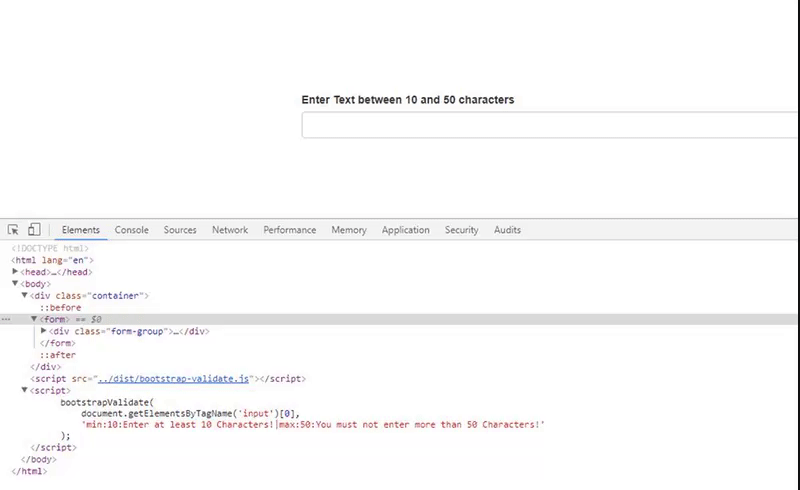

# Not really mainained!

I advise you to use other Software, e.g. the excellent https://github.com/jquery-validation/jquery-validation

# bootstrap-validate

> A simple Form Validation Utility for Bootstrap 3 and 4 which does not depend on jQuery.

[](#)

## Supported Versions

- v2: Bootstrap 4
- v1: Bootstrap 3

## Documentation

Read the Documentation at [bootstrap-validate.js.org](https://bootstrap-validate.js.org)
which resides below `docs`.

## Usage

1. Include the bootstrap-validate.js script:

```html
<script src="bootstrap-validate.js"></script>
```

2. Setup Validation for your Input Elements:

Imagine the following HTML:
```html
<div class="form-group">
    <label class="control-label">Enter a Name</label>
    <input id="name">
</div>
```

Now you want a Name to be at max 30 characters long and add the following:

```javascript
bootstrapValidate('#name', 'max:30:Your name must not be longer than 30 characters');
```

Validating an email address couldn't be easier!

```html
<div class="form-group">
  <label for="email" class="control-label">Enter your E-Mail</label>
  <div class="input" id="email">
</div>

<script>
bootstrapValidate('#email', 'email:Enter a valid email address');
</script>
```

## Download

You can find current and previous Downloads in our [Download Archive](https://bootstrap-validate.js.org/download.html).

## Changelog

See [CHANGELOG](CHANGELOG.md).

## Tests

Tests are located under `__tests__/`.
After installing all dependencies you may run `yarn test` or `npm run test` to spin up [Jest](https://facebook.github.io/jest/)-powered tests.

## License

Licensed under the MIT License, see [LICENSE](LICENSE.md).
