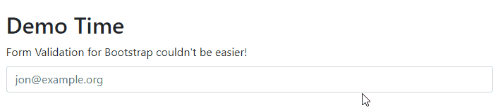

# bootstrap-validate


> A simple Form Validation Utility for Bootstrap 3, Bootstrap 4, and Bootstrap 5 for Humans.

[](#)

> ## Upcoming Release
>
> Share your opinions and feedback <https://github.com/PascaleBeier/bootstrap-validate/discussions/65>.


## Supported Versions

| bootstrap-validate Version | Bootstrap Version | Documentation                |
-----------------------------|-------------------|-------------------------------
| v1 | Bootstrap 3 | [v1 Download + Docs](https://bootstrap-validate.js.org/v1) |
| v2 | Bootstrap 4 | [v2 Download + Docs](https://bootstrap-validate.js.org/v2) |
| v3 (Upcoming) | Bootstrap 5, Bootstrap 4? | [v3 Download + Docs](https://bootstrap-validate.js.org)    |

## Documentation

Read the Documentation at [bootstrap-validate.js.org](<https://bootstrap-validate.js.org>).

## Quick Start

```bash
$ npm i bootstrap-validate
```

Include the bootstrap-validate.js script:

```html
<script defer="defer" src="bootstrap-validate.js"></script>
```

We want the `#name` to be not longer than 30 characters!

```html
<div class="form-group">
    <label class="control-label">Enter a Name</label>
    <input id="name">
</div>

<script>
bootstrapValidate('#name', 'max:30:Your name must not be longer than 30 characters');
</script>
```

Validating an `#email` address couldn't be easier!

```html
<div class="form-group">
  <label for="email" class="control-label">Enter your E-Mail</label>
  <div class="input" id="email">
</div>

<script>
bootstrapValidate('#email', 'email:Enter a valid email address');
</script>
```

## More Features!

See the v2 Documentation on <https://bootstrap-validate.js.org/v2/> to
see all available validation features, examples, and usage with module bundlers.

## Examples

See [examples/](Examples) for real-world usage.

## Download

You can find current Releases under [Releases](<https://github.com/PascaleBeier/bootstrap-validate/releases>) and
older Releases for Bootstrap 3 and Bootstrap 4 in the [Download Archive](https://bootstrap-validate.js.org/v2/download.html).

## Changelog

See [CHANGELOG](CHANGELOG.md).

## Tests

Validation Rules are at least unit-tested. Use `npm test` to spin up the test suites.
## License

Licensed under the MIT License, see [LICENSE](LICENSE.md).
