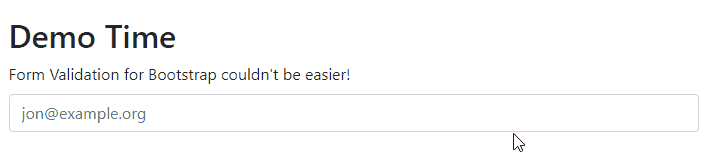

# bootstrap-validate
[](https://github.com/PascaleBeier/bootstrap-validate/actions/workflows/unit-test.yml)
[](https://github.com/PascaleBeier/bootstrap-validate/actions/workflows/lint.yml)
[](https://github.com/PascaleBeier/bootstrap-validate/actions/workflows/docs.yml)
[](https://github.com/PascaleBeier/bootstrap-validate/actions/workflows/actions-security.yml)
[](https://github.com/PascaleBeier/bootstrap-validate/releases)
[](https://www.npmjs.com/package/bootstrap-validate)
[](https://www.npmjs.com/package/bootstrap-validate)
[](LICENSE.md)

> A simple Form Validation Utility for Bootstrap 3 and Bootstrap 4 for Humans.

[](#)

## Supported Versions

| bootstrap-validate Version | Bootstrap Version | Documentation |
| --- | --- | --- |
| v1 | Bootstrap 3 | [v1 Download + Docs](https://bootstrap-validate.js.org/v1) |
| v2 | Bootstrap 4 | [v2 Download + Docs](https://bootstrap-validate.js.org/v2) |
| v3 | Bootstrap 5 | Planned refactor |

## Documentation

Read the Documentation at [bootstrap-validate.js.org](<https://bootstrap-validate.js.org>).

## Quick Start

```bash
$ npm i bootstrap-validate
```

Include the bootstrap-validate.js script:

```html
<script defer src="https://cdn.jsdelivr.net/npm/bootstrap-validate@2.3.0/dist/bootstrap-validate.js"></script>
```

We want the `#name` to be not longer than 30 characters!

```html
<div class="form-group">
    <label class="control-label">Enter a Name</label>
    <input id="name">
</div>

<script>
bootstrapValidate('#name', 'max:30:Your name must not be longer than 30 characters');
</script>
```

Validating an `#email` address couldn't be easier!

```html
<div class="form-group">
  <label for="email" class="control-label">Enter your E-Mail</label>
  <input class="input" id="email">
</div>

<script>
bootstrapValidate('#email', 'email:Enter a valid email address');
</script>
```

Validate before submit by keeping the returned handles:

```js
const validators = [
  bootstrapValidate('#email', 'required:Email required|email:Enter a valid email'),
  bootstrapValidate('#password', 'required:Password required'),
];

document.querySelector('#account').addEventListener('submit', (event) => {
  const isValid = validators.map((validator) => validator.validate()).every(Boolean);
  if (!isValid) event.preventDefault();
});
```

## More Features!

See the v2 Documentation on <https://bootstrap-validate.js.org/v2/> to
see all available validation features, examples, regex escaping, select/select2
usage, synchronous custom rules, and usage with module bundlers.

## Examples

See the documentation examples for real-world usage.

## Download

You can find current Releases under [Releases](<https://github.com/PascaleBeier/bootstrap-validate/releases>) and
older Releases for Bootstrap 3 and Bootstrap 4 in the [Download Archive](https://bootstrap-validate.js.org/v2/download.html).

## Changelog

See [CHANGELOG](CHANGELOG.md).

## Tests

Validation Rules are at least unit-tested. Use `npm test` to spin up the test suites.
## License

Licensed under the MIT License, see [LICENSE](LICENSE.md).
